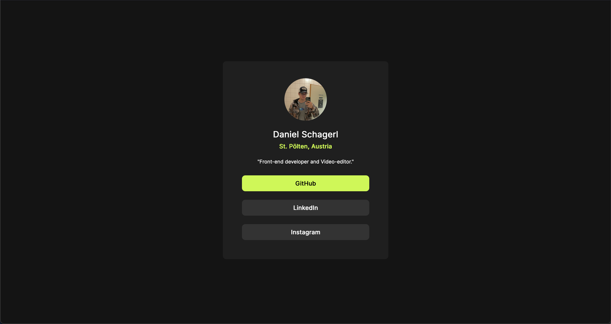

# Frontend Mentor - Social links profile

## Welcome! 👋

Thanks for checking out this front-end coding challenge.

[Frontend Mentor](https://www.frontendmentor.io) challenges help you improve your coding skills by building realistic projects.

You can find the challenge [here](https://www.frontendmentor.io/challenges/social-links-profile-UG32l9m6dQ), if you want to give it a try!

**To do this challenge, you need a basic understanding of HTML and CSS.**

## The challenge

My challenge was to create a social links profile and make it resemble the design as closely as possible.

